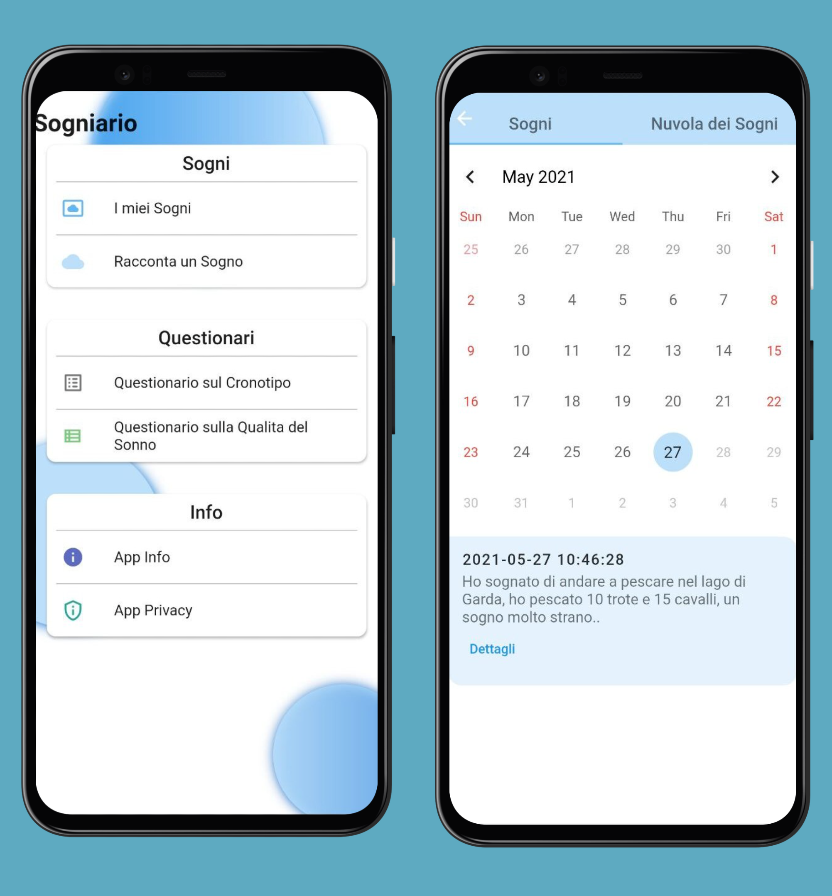

  

---

  
  
    
    <b>Sogniario</b>, progetto realizzato in <b>Flutter</b> e <b>Spring</b> per il corso di laurea <b>L-31</b> presso <b>Unicam</b>, <i>nell'anno accademico 2020/2021</i>, realizzato dal team Morpheus composto dagli studenti Giorgio Paoletti e Flavio Pocari per l'esame <b>Project</b>.
      <b>
<a href="https://www.unicam.it/">• Unicam</a>
<a href="https://github.com/GiorgioPaoletti-Unicam/sogniario">• Sogniario</img></a>
</b>

  

# 📔 Tabella dei contenuti

- [Panoramica e funzionalità](#panoramica)
- [Processo di sviluppo](#processo)
- [Tecnologie utilizzate](#tecno)
- [Autori](#autori)

# 📝 Panoramica e funzionalità 

**Sogniario è un'app creata per registrare e catalogare i tuoi sogni.**
**Prende nota della qualità del tuo sonno e delle caratteristiche dei tuoi sogni. Inoltre registra vocalmente la descrizione del tuo sogno.**
**Analizza la complessità del sogno attraverso tecniche di neurolinguistica e riporta grafi e nuvole di parole per una visualizzazione intuitiva del contenuto del sogno. Permette di tener traccia della qualità del tuo sonno e dei sogni mediante la funzione calendario.**

Sogniario nasce da una collaborazione tra il Brain and Sleep Research Laboratory dell’Università di Camerino e il Molecular Mind Laboratory della Scuola IMT Alti Studi Lucca. Ha lo scopo di aiutare gli scienziati a comprendere il funzionamento del cervello alla base dell’esperienza cosciente durante il sonno.

**Implementate**:
 - Se eseguito il primo accesso appare l'intro, dopo viene eseguita la registrazione generale dove bisogna selezionare il sesso e la data di nascita, si fa la POST che registra l'utente e viene assegnato un id univoco che rispecchia il singolo utente.
 - Appena eseguita la registrazione si arriva alla home, e se si esce e si rientra si ritorna nella home e non viene piu fatta vedere l'intro, se si esce dalla pagina di registrazione generale senza aver salvato i dati si ritorna nella pagina di intro.
 
 - Raccontare un sogno, sia tramite voce, sia scritto.
 - Compilare il questionario che riguarda il sogno, GET che ritorna il questionario funzionante.
 - POST che fa il submit del sogno e del questionario funzionante.
 
 - Compilare il questionario sul cronotipo e POST funzionante.
 
 - Vedere le informazioni che riguardano privacy e l'applicazione.
 
 - Vedere tutti i sogni nelle rispettive date, tramite la GET vengono ritornati i sogni registrati in una rispettiva data.

 - Vari alert, mostrati nel caso la chiamata REST non vada a buon fine, oppure nel caso viene registrato con successo sogno e questionario.

 - Questionario PSQI.

 - Pagina che mostra il punteggio dopo aver compilato il questionario MEQ.
   
 - Relativa logica che riguarda il reminder sul compilare i questionari.
 
 - Autenticazione mediante token JWT, dove è stato aggiunto in tutte le chiamate GET/POST.

 - Parte Web accessibile qui [Sogniario](http://193.205.92.106:8080/).
 - Nella parte Web è stata implementata la view del Researcher e quella dell' Admin.
 - L' Admin gestisce le candidature, scarica i dati e cambia le domande dei questionari, mentre il Researcher può solo scaricare i dati.

**Non implementate**:
 - Nuvola dei sogni e il relativo grafo del sogno.
 - Possibilità di aggiornare i questionari dalla pagina web.

# ⚙ Processo di Sviluppo

Per sviluppare l'applicativo è stato scelto di seguire il processo standardizzato **Unified Process (UP)**, processo iterativo incrementale, utilizzando come strumento di lavoro [**Visual Paradigm**](https://www.visual-paradigm.com/) basato sul **Unified Modeling Language (UML)**.

Attualmente sono state svolta un'iterazione dove è stato possibile effettuare l'analisi dei requisiti, la progettazione del sistema, l'implementazione.

Come strumento di versioning è stato utilizzato **Git** attraverso il quale sono stati distinti die brach per sviluppo.
- master: utilizzato per pubblicare la baseline (artefatti) sviluppati a fine iterazione.
- develop: utilizzato per lo sviluppo fino alla terza iterazione in corrispondenza alla consegna per Ingegneria del Software.

Le varie iterazioni hanno dato origine ai seguenti artefatti:
- Diagramma dei casi d'uso: raccolta e specifica dei requisiti e funzionalità del sistema.
- Diagramma classi di analisi: identificano i concetti che è necessario il sistema rappresenti e sia capace di manipolare.
- Diagrammi di sequenza: descrivono come le classi di analisi interagiscono tra di loro per realizzare il comportamento definito nei casi d'uso.
- Diagramma classi di progetto: realizzato sfruttando il principio LRG (Low Representational Gap) per derivare le classi di progetto partendo dalle classi di analisi, il diagramma verrà utilizzato per le attività di implementazione.
- Code Base

# 🧰 Tecnologie utilizzate

Il lato back end si basa sul linguaggio **Java** nella versione LTS 11 e rende disponibile per l'interazione delle **Api Rest**, la cui scrittura e gestione, anche sotto l'ottica della sicurezza, sono state rese possibili grazie al framework [**Spring Boot**](https://spring.io/). Per il building automatizzato del sistema si è impiegato il tool [**Gradle**](https://gradle.org/). Inoltre, poter rendere più agevole la scrittura del codice tramite l'uso di annotazioni, si è deciso di impiegare la libreria Java [**Lombok**](https://projectlombok.org/).

Per quanto concerne la persistenza delle informazioni processate a livello di back end si è deciso di sfruttare i servizi offerti dal DBMS non relazionale [**MongoDB**](https://www.mongodb.com) e dal relativo framework per linguaggio Java.

Per quanto concerne l'autenticazione all'interno del sistema si è deciso di utilizzare le tecnologie messe a disposizione da **Spring Boot Security** e sfruttare lo standard **JSON Web Token (JWT)** utilizzando la libreria [**Java JWT**](https://github.com/jwtk/jjwt).

Il front end è interamente scritto utilizzando il framework [**Flutter**](https://flutter.dev).
Flutter si basa su **Dart** ed offre un codice portabile. Lo sviluppo di app ibride combina elementi di app native e web. Consentono di avere un unica codebase in un unico linguaggio che può essere eseguito su più piattaforme diverse.

Nello sviluppo dell'app si è utilizzato il pattern BLoC (Business Logic Component).
Suddividendo il progetto in 4 directory:
 - models.
 - views, directory che contiene la UI.
 - services, directory che contiene le API REST, eventuali route e le informazioni da tenere memorizzate che riguardano utente e server.
 - widgets, directory che contiene i widget stateless, ovvero quei widget che non hanno uno stato, cosi da avere componenti riutilizzabili.

# 🔭 Autori 

- [Giorgio Paoletti](https://github.com/GiorgioPaoletti-Unicam)
- [Flavio Pocari](https://github.com/flaviopopoff)
